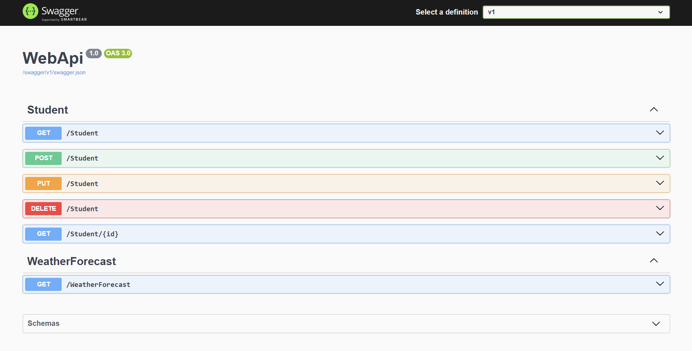

# Clean Architecture Student API

This project is a simple RESTful API built on the .NET framework, demonstrating the principles of Clean Architecture. It provides basic CRUD (Create, Read, Update, Delete) operations for a Student entity
and handles Exceptions on the Program.cs level, using an exception handling middleware.
----
## Project Structure

**WebApi:** The entry point of the application. It contains the controllers that expose the API endpoints.

**Clean.Application:** The application layer, which contains the business logic and service interfaces.

**Clean.Infrastructure:** The infrastructure layer, responsible for data access using Dapper and managing the database connection.

**Clean.Domain:** This would be a core layer for shared entities and models like the Student class.

-----
## API Endpoints
The API is documented using Swagger UI. You can access the documentation to test the endpoints locally when the application is running.

* **GET** /Student: Retrieves a list of all students.

* **GET** /Student/{id}: Retrieves a student by their unique ID.

* **POST** /Student: Adds a new student to the database.

* **PUT** /Student: Updates an existing student's information.

* **DELETE** /Student/{id}: Deletes a student by their unique ID.
------
## Database
This project uses a database and relies on Dapper for ORM (Object-Relational Mapping). The connection string and database configuration are managed in the appsettings.json file.

------
## How to Run
1. Make sure you have the .NET SDK installed.
2. Restore the NuGet packages in the terminal: `dotnet restore`. This command reads the project's .csproj file to determine and restore the necessary packages.
3. Run the application: dotnet run 
4. Navigate to the Swagger UI in your browser to test the API.
---
# Expected Result:

----
## **Good luck with your Clean Implementation :)**